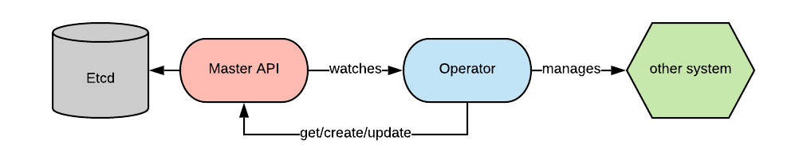

# kubernetes operator 简介

## k8s operator 介绍

k8s Operator 是一种特定于应用的控制器，可扩展 Kubernetes API 的功能，来代表 k8s 用户创建、配置和管理复杂应用的实例，它基于基本 k8s 资源和控制器概念构建，但又涵盖了特定领域或应用的知识，用于实现其所管理的应用生命周期的自动化，常见的有 [etcd-operator](https://github.com/coreos/etcd-operator)、[prometheus-operator](https://github.com/prometheus-operator/prometheus-operator) 等，以下是 k8s operator 执行的一些最常见功能的列表：

* 部署指定配置和数量的应用
* 对应用进行扩缩容
* 启动升级、自动备份和故障恢复
* 执行任何其他可以作为代码呈现的管理应用的任务

## operator 工作原理

k8s operator 是使用自定义资源(CR)管理应用及其组件的自定义 k8s 控制器，自定义资源是 k8s 中的 API 扩展机制。自定义资源定义(CRD)会声明 CR 并列出 Operator 用户可用的所有配置

当 operator 被部署到 k8s 集群中会通过连接 master 节点的 API server 监听特定资源类型的事件并基于用户在 CR 中提供的配置和嵌入在 operator 处理逻辑采取对应的操作，进行循环处理确保当前该资源的状态与理想状态相符



## 编写一个简单的 operator

operator SDK 是 CoreOS 公司开发和维护的用于快速创建 operator 的工具，可以ß助我们快速构建 operator 应用，类似的工具还有：

* KUDO (Kubernetes 通用声明式 Operator)
* kubebuilder，kubernetes SIG 在维护的一个项目
* Metacontroller，可与 Webhook 结合使用，以实现自己的功能

接下来会使用 [operator-sdk](https://github.com/operator-framework/operator-sdk) 构建一个简单的 operator 项目

开发环境:
```
docker 20.10.5
operator-sdk 1.9.0
golang 1.16.3
kubernetes 1.19
macOS 11.4
```

### 1. 使用 operator-sdk CLI 创建 nginx-operator 项目

```bash
mkdir -p $HOME/nginx-operator && cd $HOME/nginx-operator
operator-sdk init --domain example.com --repo github.com/example/nginx-operator
```

### 2. 创建新的 `CRD` API 指定组为 proxy 类型为 Nginx 版本为 v1alpha1

```bash
operator-sdk create api --group proxy --version v1alpha1 --kind Nginx --resource --controller
```
该命令生成的 `api/v1alpha1/nginx_types.go` 和  `controllers/nginx_controller.go` 文件是需要我们分别实现 CR 的配置和控制器的处理逻辑

### 3. 定义 Nginx 资源类型 CR 并生成 CRD

修改文件 `api/v1alpha1/nginx_types.go` 中的 `NginxSpec` 和 `NginxStatus` 如下

```go
// NginxSpec defines the desired state of Nginx
type NginxSpec struct {
	Count int32 `json:"count"`
}

// NginxStatus defines the observed state of Nginx
type NginxStatus struct {
	// Nodes are the names of the nginx pods
	Nodes []string `json:"nodes"`
}
```
执行下面的命令生成 CR 资源相关代码，每次修改 CR 的定义都需执行该命令

```bash
make generate
```

执行下面的命令会生成 CRD 定义文件 nginx-operator/config/crd/bases/proxy.example.com_nginxes.yaml

```bash
make manifests
```

### 4. 控制器处理逻辑实现
需要在 controllers/nginx_controller.go 实现以下逻辑,可参考 [nginx_controller.go](https://github.com/nufy323/nginx-sample-operator/blob/main/controllers/nginx_controller.go)

实现 SetupWithManager 方法设置要监听的资源对象，如下代码中指定了主要监听对象为 Nginx，次要监听对象为 Deployment：

```go
func (r *NginxReconciler) SetupWithManager(mgr ctrl.Manager) error {
	return ctrl.NewControllerManagedBy(mgr).
		For(&proxyv1alpha1.Nginx{}).
		Owns(&appsv1.Deployment{}).
		Complete(r)
}
```

Reconcile 方法中用来维护前 k8s 环境中监听的对象使其达到预期的状态，每当被监听的资源对象触发新的事件该方法会被调用

```go
func (r *NginxReconciler) Reconcile(ctx context.Context, req ctrl.Request) (ctrl.Result, error) {
	log := ctrllog.FromContext(ctx)

	return ctrl.Result{}, nil
}
```

### 5. 部署 operator

#### 1. 修改 Makefile 

```
-IMG ?= controller:latest
+IMG ?= $(IMAGE_TAG_BASE):$(VERSION)
```
#### 2. 编译并部署 operator 镜像

```bash
make docker-build
make deploy
```

#### 3. 查看 deployment

```
$ kubectl get deployment -n nginx-operator-system
NAME                                READY   UP-TO-DATE   AVAILABLE   AGE
nginx-operator-controller-manager   1/1     1            1           5m14s
```
#### 4. 创建 Nginx CR

修改文件 config/samples/proxy_v1alpha1_nginx.yaml 如下:

```yaml
apiVersion: proxy.example.com/v1alpha1
kind: Nginx
metadata:
  name: nginx-sample
spec:
  count: 3
```
执行命令 `kubectl apply -f config/samples/proxy_v1alpha1_nginx.yaml` 创建 CR

获取创建的 pod 

```
$ kubectl get pods
NAME                            READY   STATUS    RESTARTS   AGE
nginx-sample-66b6c48dd5-bcqc8   1/1     Running   0          15m
nginx-sample-66b6c48dd5-thnx6   1/1     Running   0          15m
nginx-sample-66b6c48dd5-xrd9l   1/1     Running   0          15m
```

#### 5. 检查 CR 的状态

```
$ kubectl get nginx/nginx-sample -o yaml
apiVersion: proxy.example.com/v1alpha1
kind: Nginx
metadata:
  name: nginx-sample
  namespace: default
  ...
spec:
  count: 3
status:
  nodes:
  - nginx-sample-66b6c48dd5-bcqc8
  - nginx-sample-66b6c48dd5-thnx6
  - nginx-sample-66b6c48dd5-xrd9l
```
若需要清理执行以下命令

```bash
kubectl delete -f config/samples/proxy_v1alpha1_nginx.yaml
make undeploy
```