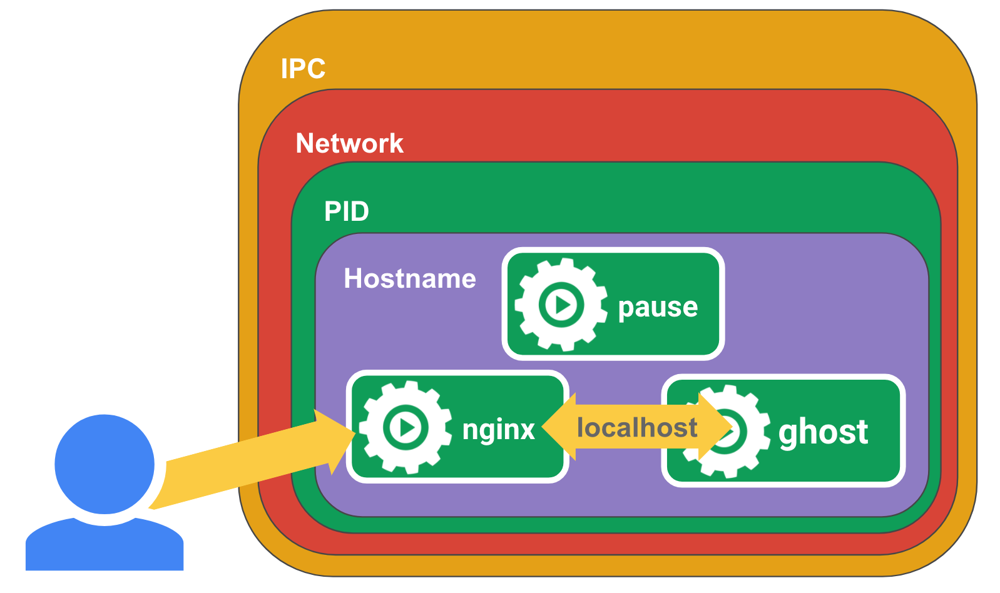
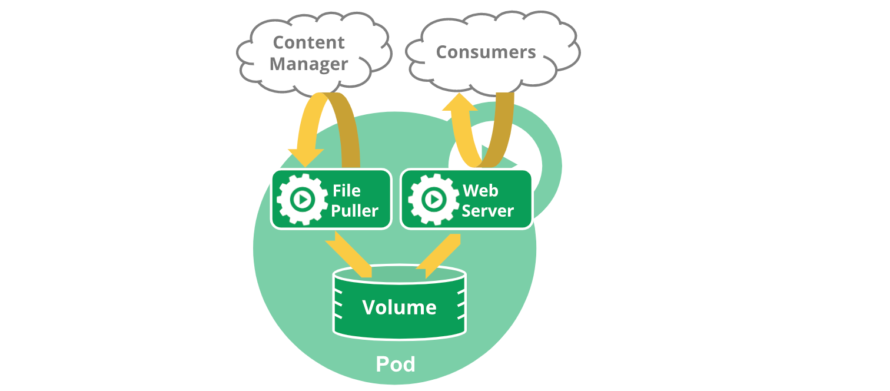
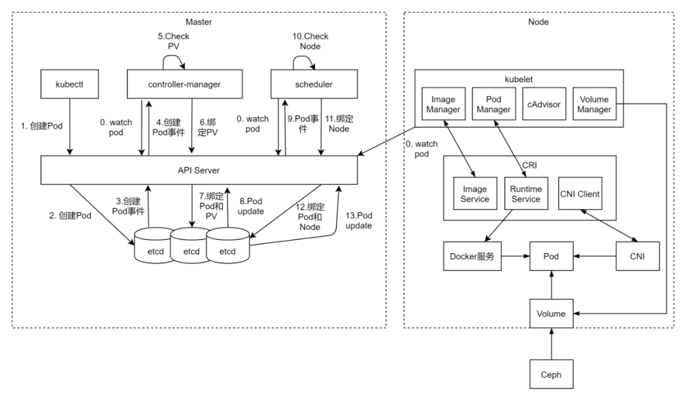

# kubernetes pod 简介

## pod 是什么

Pod 是一组互相协作的容器，是我们可以在 Kubernetes 中创建和管理的最小可部署单元。同一个 pod 内的容器共享网络和存储，并且作为一个整体被寻址和调度。当我们在 Kubernetes 中创建一个 pod 会创建 pod 内的所有容器，并且将容器的所有资源都被分配到一个节点上。

## 为什么需要 pod

思考以下问题，为什么不直接在 kubernetes 部署容器？为什么需要把多个容器视作一个整体？为什么不使用同一个容器内运行多个进程的方案？

当一个应用包含多个进程且通过 `IPC` 方式通讯，需要运行在同一台主机。如果部署在 kubernetes 环境进程需要运行在容器内，所以可能考虑方案之一是把多个进程运行在同一个容器内以实现类似在同一个主机的部署模式。但是 container 的设计是每个容器运行一个单独的进程，除非进程本身会创建多个子进程，当然如果你选择在同一个容器内运行多个没有联系的进程的话，那么需要自己来管理其他进程，包括每个进程的生命周期(重启挂掉的进程)、日志的切割等。如果多个进程都在标准输出和标准错误输出上输出日志，就会导致日志的混乱，因此 docker 和 kubernetes 希望我们在一个容器内只运行一个进程。

排除在同一个容器内运行多个进程的方案后，我们需要一个更高层级的组织结构实现把多个容器绑定在一起组成一个单元，这就是 pod 概念的由来，Pod带来的好处：
1. Pod做为一个可以独立运行的服务单元，简化了应用部署的难度，以更高的抽象层次为应用部署管提供了极大的方便。
2. Pod做为最小的应用实例可以独立运行，因此可以方便的进行部署、水平扩展和收缩、方便进行调度管理与资源的分配。
3. Pod中的容器共享相同的数据和网络地址空间，Pod之间也进行了统一的资源管理与分配。

##  pause 容器

因为容器之间是使用 Linux Namespace 和 cgroups 隔开的，所以 pod 的实现需要解决怎么去打破这个隔离。为了实现同 pod 的容器可以共享部分资源，引入了 pause 容器。 pause 容器的镜像非常小，运行着一个非常简单的进程。它几乎不执行任何功能，启动后就永远把自己阻塞住。每个 Kubernetes Pod 都包含一个 pause 容器， pause 容器是 pod 内实现 namespace 共享的基础。

在 linux 环境下运行一个进程，该进程会继承父进程所有的 `namespace`，同时也可以使用 `unsharing` 方式创建新的 `namespace`。如下使用 `unshare` 方式运行 shell 并创建新的 PID、UTS、IPC 和 mount 命名空间。

```bash
sudo unshare --pid --uts --ipc --mount -f chroot rootfs /bin/sh
```
其他进程可以使用系统调用 `setns` 加入到新的命名空间，`pod` 的实现方式也是类似，通过如下命令演示如何手动创建一个简易的 `pod`

```bash
## 首先运行一个 pause 容器
docker run -d --name pause -p 8880:80 --ipc=shareable gcr.io/google_containers/pause-amd64:3.0

## 创建 nginx 容器，并将其加入到 pause 容器 net ipc 和 pid namespace
$ cat <<EOF >> nginx.conf
error_log stderr;
events { worker_connections  1024; }
http {
    access_log /dev/stdout combined;
    server {
        listen 80 default_server;
        server_name example.com www.example.com;
        location / {
            proxy_pass http://127.0.0.1:2368;
        }
    }
}
EOF

docker run -d --name nginx -v `pwd`/nginx.conf:/etc/nginx/nginx.conf --net=container:pause --ipc=container:pause --pid=container:pause nginx

## 运行 ghost 容器 并将其加入到 pause 容器 network ipc 和 pid namespace
docker run -d --name ghost --net=container:pause --ipc=container:pause --pid=container:pause ghost
```
在 ghost 容器中使用 ps 可以看到 pause 和 nginx 进程, 

```bash
USER       PID %CPU %MEM    VSZ   RSS TTY      STAT START   TIME COMMAND
root         1  0.0  0.0   1032     4 ?        Ss   10:06   0:00 /pause
root         8  0.0  0.1   8864  3120 ?        Ss   10:15   0:00 nginx: master process nginx -g daemon off;
101         38  0.0  0.1   9312  3088 ?        S    10:15   0:00 nginx: worker process
node        48  0.3  6.9 969996 142296 ?       Ssl  10:18   0:09 node current/index.js
```

通过 localhost:8080 访问 ghost 页面，那么应该能够看到 ghost 通过 Nginx 代理运行，因为 pause、nginx 和 ghost 容器之间共享 network namespace，如下图所示。



## pod 常用方式

pod 使用方式可以被分为两种类型：
1. pod 内只运行一个容器。这种情况可把 pod 视为容器的包装器，kubernetes 通过管理 pod 方式管理容器；
2. pod 内运行多个需要共享资源紧密协作的容器。如下图所示，两个容器通过 Volume 共享文件，Filer Puller 从远端更新文件，Web Server 负责文件的展示；



是否把两个容器分配在不同或同一个 pod，通常需要考虑以下几点：
  1. 它们是否有必要运行在同一个 kubernetes 节点?
  2. 它们代表一个整体，还是独立的组成部分?
  3. 它们是否有必要整体扩缩容?


## Pod 的使用

### 创建 Pod

通过如下方式 `kubectl apply -f nginx-pod.yaml` 创建 pod，并通过 `kubectl get pod` 查看 pod 的状态，如下所示。

```yml
apiVersion: v1 
kind: Pod
metadata:
  name: nginx  # pod 名称
spec:
  containers:   # 容器列表
  - name: nginx # 容器名称
    image: nginx:1.14.2 # 容器使用镜像
    ports:  # 容器端口映射
    - containerPort: 80
```

执行 `kubectl describe pod nginx` 查看 pod 的状态，如下所示展示了 pod 部分信息，`Status` 字段是 pod 在其生命周期中的一个摘要介绍，Running 表示 pod 处于正常运行状态

```bash
Name:         nginx
Namespace:    default
.....
Start Time:   Sat, 04 Jun 2022 09:24:36 +0000
Labels:       <none>
.....
Status:       Running
IP:           10.42.1.139
Containers:
  nginx:
    Container ID:   docker://xxxx
    Image:          nginx:1.14.2
    Image ID:       docker-pullable://
.....
```

### pod 的生命周期

Pod 创建完成后，遵循定义的生命周期，从 Pending 阶段开始，如果 pod 内至少一个容器启动正常，则进入 Running，然后根据 Pod 中的任何容器是否因故障终止而进入 Succeeded 或 Failed 阶段，pod 在其生命周期可能处于以下几种状态

* Pending： Pod 已被 Kubernetes 集群接受，但一个或多个容器尚未准备好运行。这包括 Pod 等待调度所花费的时间以及通过网络下载容器镜像所花费的时间。
* Running： Pod 已绑定到一个节点，并且所有容器都已创建。至少有一个容器仍在运行，或者正在启动或重新启动过程中。
* Succeeded： Pod 中的所有容器都已成功终止，不会重新启动。
* Failed：Pod 中的所有容器都已终止，并且至少有一个容器因故障而终止。也就是说，容器要么以非零状态退出，要么被系统终止。
* Unknown： 由于某种原因，无法获取 Pod 的状态。此阶段通常是由于与应该运行 Pod 的节点通信时出错而发生。


## pod 创建流程

所有的 Kubernetes 组件 Controller, Scheduler, Kubelet 都使用 Watch 机制来监听 API Server，来获取对象变化的事件，创建 pod 
的大致流程如下




1. 用户通过 Kubectl 提交 Pod` 描述文件到 API Server；
2. API Server 将 Pod 对象的信息存入 Etcd；
3. Pod 的创建会生成事件，返回给 API Server；
4. Controller 监听到事件；
5. Pod 如果需要要挂载盘，Controller 会检查是否有满足条件的 PV；
6. 若满足条件的 PV，Controller 会绑定 Pod 和 PV，将绑定关系告知 API Server；
7. API Server 将绑定信息写入 Etcd；
8. 生成 Pod Update 事件；
9. Scheduler 监听到 Pod Update 事件；
10. Scheduler 会为 Pod 选择 Node；
11. 如有满足条件的 Node，Scheduler 会绑定 Pod 和 Node，并将绑定关系告知 API Server；
12. API Server 将绑定信息写入 Etcd；
13. 生成 Pod Update 事件；
14. Kubelet 监听到 Pod Update 事件，创建 Pod；
15. Kubelet 告知 CRI(容器运行时接口) 下载镜像；
16. Kubelet 告知 CRI 运行容器；
17. CRI 调用 Docker 运行容器；
18. Kubelet 告知 Volume Manager，将盘挂在到 Node 同时挂载到 Pod；
19. CRI 调用 CNI(容器网络接口) 配置容器网络；