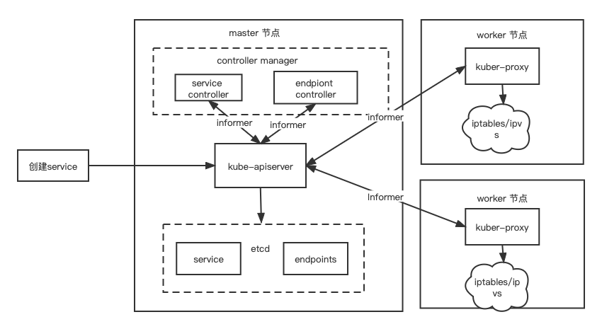

# kubernetes Service 工作原理介绍

## Service 是什么

Service 是 Kubernetes 一种资源，用于实现恒定的入口访问一组提供相同服务的 Pod。每个 Service 在其生命周期内拥有固定的 IP 和 Port，客户端可以通过访问该 IP 和端口访问到和其关联的所有 Pod。这样服务的客户端不需要知道提供服务的各个 Pod 的位置，从而允许这些 Pod 在集群中移动。

首先我们使用 Deployment 创建标签为 app=nginx 的三个 Pod

```yml
apiVersion: apps/v1
kind: Deployment
metadata:
  name: nginx-deployment
  labels:
    app: nginx
spec:
  replicas: 3
  selector:
    matchLabels:
      app: nginx
  template:
    metadata:
      labels:
        app: nginx
    spec:
      containers:
      - name: nginx
        image: nginx:1.14.2
        ports:
        - containerPort: 80
```

如下 Deeplyment 创建了三个 Pod

```
NAME                                READY   STATUS    RESTARTS   AGE    IP          NODE     NOMINATED NODE   READINESS GATES
nginx-deployment-6b474476c4-hc6k4   1/1     Running   0          7d2h   10.42.1.3   node8    <none>           <none>
nginx-deployment-6b474476c4-mp8vw   1/1     Running   0          7d2h   10.42.0.7   node10   <none>           <none>
nginx-deployment-6b474476c4-wh8xd   1/1     Running   0          7d2h   10.42.1.4   node8    <none>           <none>
```

接下来我们定义一个名为 my-service 的 Service 资源并指定选择器为 app=nginx, 其中 selector 定义了可以通过 Label Selector 访问 Pod 组。

```yml
apiVersion: v1
kind: Service
metadata:
  name: my-service
spec:
  selector:
    app: nginx
  ports:
  - name: default
    protocol: TCP
    port: 80 #service port
    targetPort: 80 
```

如下我们成功创建了一个默认类型为 ClusterIP 的 Service 对象，并随机分配了一个 ClusterIP  10.109.163.26 此后我们就可以通过该 IP 和 Port 访问到之前创建的 Pod 了，Service 的默认方访问模式为轮询模式，即轮询将请求转发到后端的各个 Pod 

```
NAME         TYPE        CLUSTER-IP      EXTERNAL-IP   PORT(S)   AGE    SELECTOR
my-service   ClusterIP   10.109.163.26   <none>        80/TCP    4d1h   app=nginx
```

## 为什么需要 Service

Service 在我们使用 Kubernetes 几乎必不可少的一个资源对象主要包括以下原因

* 集群中的每一个 Pod 都可以通过 PodIP 被直接访问的，但是 Kubernetes 中的 Pod 是有生命周期的对象，尤其是被 ReplicaSet、Deployment 等对象管理的 Pod，随时都有可能由于集群的状态变化被销毁和创建，导致 Pod 的 IP 发生变化
* Pod 被 Kubernetes 调度到确定的节点后，才会为 Pod 分配 IP 地址，在启动之前客户端无法知道服务器 Pod 的 IP 地址。
* 水平扩展意味着多个 Pod 可以提供相同的服务，每个 Pod 都可以提供相同的服务 Pod 有自己的 IP 地址。客户端不应该关心有多少 Pod 支持服务及其 IP 是什么而且不应该保留所有 Pod 的 IP 列表。相反所有这些 Pod 都应该可以通过单个 IP 地址提供服务


## Service 工作原理

在 Kubernetes 中创建一个新的 Service 对象会涉及到两大模块，其中一个模块是控制器，它需要在每次客户端创建新的 Service 对象时，生成用于暴露一组 Pod 的 Kubernetes 对象，也就是 Endpoint 对象；另一个模块是 kube-proxy，它运行在 Kubernetes 集群中的每一个节点上，两大模块同时协作实现了 Service 功能



1. 当我们发起创建 Service 请求时 kube-apiserver 会生成一个 Service 对象并将其保存到 ETCD
2. Endpoint Controller 在订阅到 Service 创建时会创建对应的 Endpoint 对象
3. kube-proxy 会订阅 Service 和 Endpoint 变动改变节点上 iptables/ipvs 中保存的规则。

接下来会分别介绍这量大模块是何协作实现 Service 功能

#### endpoint

如上文所述当我们创建 Service 时，同时也会生成如下所示的 endpoint，
```
NAME         ENDPOINTS                                AGE
my-service   10.42.0.7:80,10.42.1.3:80,10.42.1.4:80   7d3h
```

Endpoint 是 Kubernetes 集群中的一个资源对象存储在etcd中，从上文可以看到 Endpoint 中保存了一个 Service 对应的所有 Pod 的访问地址，Endpoint 的创建和更新是通过 Endpoint Controller，当我们通过API创建/修改 Service 对象时，Endpoints Controller 的 informer 机制监听到 Service对象更新，然后根据 Service 的配置的 Selector 创建对应 Endpoint 对象，此对象将 Pod 的 IP、容器端口做记录并存储到 Etcd，这样 Service 只要看一下自己名下的 Endpoint 就可以知道所对应Pod信息了。 

Endpoint Controller 是 kube-controller-manager 组件中众多控制器中的一个，是 Endpoint 资源对象的控制器，其通过对 Service、Pod 两种种资源的监听，对相应的 EndPoint 资源进行管理，主要包括以下功能:

* 负责生成和维护所有 Endpoint 对象
* 负责监听 Service 和对应 Pod 的变化
* 监听到 Service 被删除，则删除和该 Service 同名的 Endpoint 对象
* 监听到新的 Service 被创建，则根据新建 Service 信息获取相关 Pod 列表，然后创建对应 Endpoint 对象
* 监听到 Service 被更新，则根据更新后的 Service 信息获取相关 Pod 列表，然后更新对应 Endpoint 对象
* 监听到 Pod 事件，则更新 endpoint 对象保存的 Pod IP 列表, 如 Pod 处于非健康状态时则把 Pod 从保存的 IP 列表中移除，恢复时再重新加入


#### kube-proxy 

kube-proxy 是 kubernetes 一个网络代理组件，运行在每个 worker 节点上。Kube-proxy 维护节点上的网络规则，实现了 Kubernetes Service 概念的一部分，它的作用是使发往 Service 的流量（通过ClusterIP和端口）负载均衡到正确的后端 Pod,
kube-proxy 支持多种配置模式主要包括 iptable 和 ipvs 模式，本文则基于 iptable 模式描述 kube-proxy 的工作原理， kube-proxy 的主要职责包括两大块：

* 监听 Service 更新事件，并更新 Service 相关的 iptables 规则。
* 监听 Endpoint 更新事件，更新 Endpoint 相关的 iptables 规则, 如 KUBE-SVC-链中的规则会把包请求转入 Endpoint 对应的Pod。如果某个 Service 尚没有 Pod 创建，那么针对此 Service 的请求将会被 drop 掉。

在 iptables 模式下,创建 Service 会创建一系列的 iptable 规则，

首先我们在任意一台 worker 节点执行 iptables -nvL OUTPUT -t nat 查看 iptables net 表的 output 链, 存在 kube-proxy 创建的 KUBE-SERVICE 链

```
Chain OUTPUT (policy ACCEPT 40606 packets, 2435K bytes)
pkts bytes target     prot opt in     out     source               destination
15M  929M KUBE-SERVICES  all  --  *      *       0.0.0.0/0            0.0.0.0/0            /* kubernetes service portals */
```

执行 iptables -nvL KUBE-SERVICES -t nat 查看  KUBE-SERVICES 链，可以看到 clusterIP 10.43.7.11 跳转到 KUBE-SVC-KEAUNL7HVWWSEZA6

```
Chain KUBE-SERVICES (2 references)
 pkts bytes target     prot opt in     out     source               destination
    0     0 KUBE-SVC-KEAUNL7HVWWSEZA6  tcp  --  *      *       0.0.0.0/0            10.43.7.11           /* default/my-service: cluster IP */ tcp dpt:80
```


然后我们执行 iptables -nvL KUBE-SVC-KEAUNL7HVWWSEZA6 -t nat 查看  KUBE-SVC-KEAUNL7HVWWSEZA6 可以看到以不同的概率进行了跳转

```
Chain KUBE-SVC-KEAUNL7HVWWSEZA6 (1 references)
 pkts bytes target     prot opt in     out     source               destination
    0     0 KUBE-SEP-SKMF2UJJQ24AYOPG  all  --  *      *       0.0.0.0/0            0.0.0.0/0            /* default/my-service: */ statistic mode random probability 0.33333333349
    0     0 KUBE-SEP-BAKPXLXOJZJDGFKA  all  --  *      *       0.0.0.0/0            0.0.0.0/0            /* default/my-service: */ statistic mode random probability 0.50000000000
    0     0 KUBE-SEP-M4RM3QHTJOBNSPNE  all  --  *      *       0.0.0.0/0            0.0.0.0/0            /* default/my-service: */
```

最后执行 iptables -nvL KUBE-SEP-SKMF2UJJQ24AYOPG  -t nat 查看其中一条通过 DNAT发送到其中一个 Pod 地址 10.42.0.7:80 

```
Chain KUBE-SEP-SKMF2UJJQ24AYOPG (1 references)
 pkts bytes target     prot opt in     out     source               destination
    0     0 DNAT       tcp  --  *      *       0.0.0.0/0            0.0.0.0/0            /* default/my-service: */ tcp to:10.42.0.7:80
```

从上问所述可知在 Service 创建时会生成大量的 iptalbes 规则，当服务数量非常庞大时 iptables 规则也会成倍增长，带来的问题是路由延迟和服务访问延迟，而且由于 iptables 使用非增量式更新当规则数量庞大时添加或删除一条规则也有较大延迟, 为了解决该问题所以 kubernetes 在 1.11 之后版本推出了 ipvs 模式，如想详细了解可参考 https://kubernetes.io/blog/2018/07/09/ipvs-based-in-cluster-load-balancing-deep-dive

